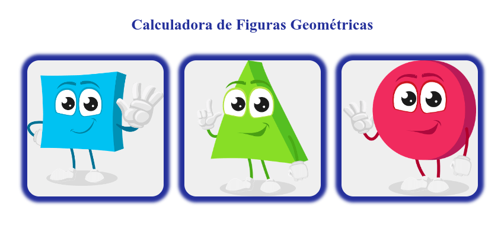
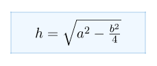
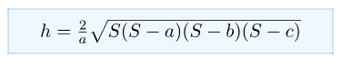
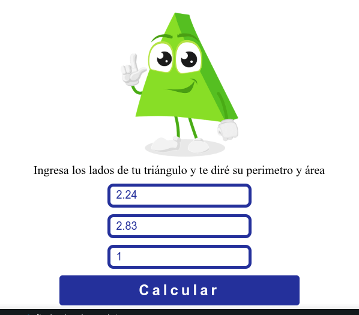
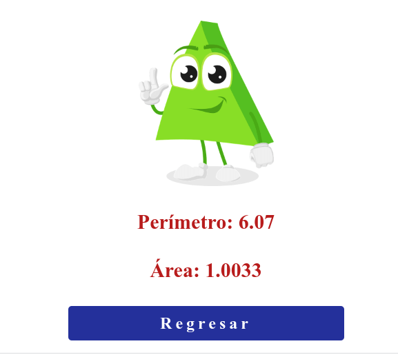

# Math with JavaScript



**Visitala** haciendo click :point_right: [aquí](https://guadamongebarale.github.io/math-javascript/index.html) :point_left:

---

## Te expico algunos de los conceptos que apliqué en el proyecto

---
---

### :fire: Maquetación Responsive Dising: Mobile First 

Información en este [proyecto](https://github.com/GuadaMongeBarale/LandingMobileFirst)

---

### :rocket: Cálculo de perímetro y área de figuras geométricas con JavaScript

Según la figura geométrica que escoja el usuario realizamos las operaciones.

------------
### Cuadrado

**Area** = l x l

```javascript
function areaSquare (sideSquare) {
    return (sideSquare * sideSquare);
}
```

**Perímetro** = l x 4

```javascript
function perimeterSquare(sideSquare) {
    return (sideSquare * 4);
}
```
------------
### Círculo

**Area** = PI x radio al cuadrado
Hacemos uso de Math para que el cálculo sea más exacto y con toFixed le dejamos solo 4 decimales.

```javascript
const PI = Math.PI;
function areaCircle(radius) {
    return (PI * (radius * radius)).toFixed(4);
}
```

**Perimetro de la Cicunsferencia** = diámetro x PI

El diámetro es igual a radio x 2

```javascript
function diameterCircle(radius) {
    return (radius * 2);
}
function perimeterCircle(radius) {
    const diameter = diameterCircle(radius);
    return (diameter * PI).toFixed(4);
}
```

-----------
### Triángulo


**Perimetro** = la suma de todos sus lados

```javascript
function perimeterTriangle(s1Triangle, s2Triangle , baseTriangle) {
    return (parseFloat(s1Triangle) + parseFloat(s2Triangle) + parseFloat(baseTriangle));
}
```
**Área** = base x altura / 2

```javascript
function areaT(base, h) {
    const area = ((base * h) / 2);
    return area.toFixed(4);    
}
```

La altura del triángulo va a depender de que tipo de triángulo es.

* Equilatero: sus lados son iguales con base diferente

* Isosceles: sus tres lados tienen la misma longitud

* Escaleno: distintas medidas en sus lados

Lo verificamos primero

```javascript
function typeTriangle (sideA, sideB, baseT){
    if (sideA === sideB && sideA === baseT) {
        return 'equilatero';
    }
    else if (sideA === sideB && sideA != baseT) {
        return 'isosceles';
    }
    else {
        return 'escaleno';
    }
}
```
#### Calcular la altura de un Triángulo Eqilatero

Es igual a la raiz cuadrada de lado al cuadrado menos lado dividido 2 al cuadrado

[Explicación detallada](https://laescuelaencasa.com/la-altura-triangulo-equilatero/)

```javascript
function hEquilateral(side){
    side2 = (side * side);
    halfSide = (side / 2);
    halfSide2 = (halfSide * halfSide);
    h = (side2 - halfSide2);
    h = Math.sqrt(h);

    return h;
}
```
#### Calcular la altura de un Triángulo Isosceles



[Explicación detallada](https://www.neurochispas.com/wiki/altura-del-triangulo-isosceles/#:~:text=La%20altura%20de%20un%20tri%C3%A1ngulo,uno%20de%20los%20lados%20congruentes.)

```javascript
function heightTriangle(side, base) {
    base = ((base * base ) / 4);
    side = side * side;
    h = side - base;
    h = Math.sqrt(h);

    return h;
}
```

#### Calcular la altura de un Triángulo Escaleno

Primero debemos calcular el semiperímetro (S) que es igual a la suma de todos los lados dividios entre 2

Todo listo para la fórmula



[Explicación detallada](https://www.neurochispas.com/wiki/altura-de-un-triangulo-escaleno/)

```javascript
function hEsq(sideA, sideB, baseT){
    const s = ((parseFloat(sideA) + parseFloat(sideB)+ parseFloat(baseT) ) / 2 );
    h = Math.sqrt(s * ((s - baseT) * (s - sideA) * (s - sideB)));
    h = ((h * 2) / baseT);
    return h;
}
```

---

### :collision: Manipulación del DOM

Los nodos se crean con **createElement** y su contenido con **textContent**.  

Los hace visibles **append()**

**append** es la evolución de *appendChild* ya que permite agregar más de un nodo a la vez. 

Esto significa que a medida que el usuario hace click en determinados botones, JavaScript escucha el evento y procede a dibujar el DOM


